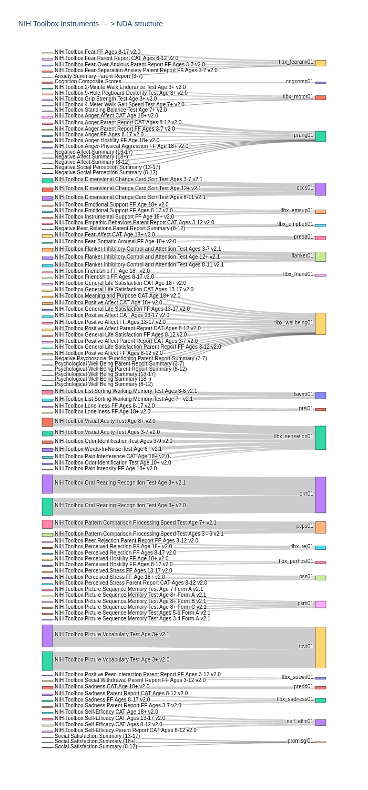

THIS REPO IS UNDER CONSTRUCTION.  WE WILL REMOVE THIS MESSAGE WHEN WE FINALIZE NAMES AND DOCUMENTATION.  USE AT YOUR OWN RISK.

# NIHToolbox2NDA
collection of python3 commands and a couple of useful functions in a two places that are logically separated by necessary hand editing of a crosswalk file.  
Order of operations:
1.  Concatenate all the scores files you received from the IPADS.  Concatenate all the raw data (item level) files you received from the IPADs. Check that the unique PINS in the concantenated scores file matches the list of unique pins in the concatenated raw data files.

2.  Run crosswalkscratch.py locally, which is a tool to assist with the concatenation of files that the NDA sends when you ask for new NIH Toolbox Instruments to be mapped.  -- see comments inline and pictures below.

3.  Hand edit the crosswalk by appending the output of 2 to the current crosswalk of all NIH Toolbox (if you're lucky you'll never have to do this because you won't be the first...just look to this repository for the curated NIH Toolbox Crosswalk File and pray that NIH Toolbox App developers dont change their output format).  The end goal of this crosswalk file is to have every single item level response and score for a given NIH Toolbox Instrument be mapped to a specific element/structure in the NDA. Might need to add some python statements...if 'Form requests' are present.  More on that later.

4. prepare the NDA fields info file for your data - e.g. a csv with subjectkey (GUID or pseudo-GUID), src_subject_id (e.g. PIN, or subject or whatever you call it -ex. HCP0211999), interview_age (in months), and gender (misnomer for sex assigned at birth)

5.  launch the jupyter notebook to transform your concatenated IPAD exports into NDA-formatted uploadable csv files based on the curated crosswalk from 3.  

Some extra details about how it all comes together in step 5:

Besides setting up the environment with the requirements.txt file, you'll have prepared four files by now.

Two are in the .csv format of the IPAD Toolbox applcation export (step 1). E.g. a raw Data file containing item level responses, and a Scores file, containing the summary statistics for the collection of item level data. We don't need the registration file. These two files are linked by PIN and Inst variables, and must be cleaned a priori, to remove subjects that are in one but not the other file. I.e. the list of unique PINs (ex. HCP0211999_V1) in one file should be exactly the same as the list of unique PINs in the other. For HCP data, we concatenate the exports of all subjects' Score data in to a single file, and the exports of all subjects Raw data into a second file. Because all other sources of HCP data use 'subject' and 'visit' rather than a PIN which is a concatenation of both, we create these variables (subject and visit) from PIN prior to running this program as well.

The third necessary file is a csv containing the fields that NDA requires in all of their structures e.g. subjectkey (GUID or pseudo-GUID), src_subject_id (e.g. HCP0211999), interview_age (in months), and gender (misnomer for sex assigned at birth). In HCP data, we link the two sources of information via 'subject' and 'visit.'  You should have prepared this in step 4.

Lastly, a crosswalk file - this will map your vars to NDA after transpose is complete. I have placed the crosswalk from HCPA as an example. Any instruments in this crosswalk that are the same as yours (look at 'Inst' column) will work for you. You will have to add any instruments not present, after obtaining variable maps and templates from the NDA for your particular set of NIH Toolbox Data (see step 2).  If you get these maps and templates from the NDA in the form of several (dozen) zipped directories, you can use crosswalkscratch.py (step 2) in this repository to facilitate the transformation of NDA requests into a centralzied crosswalk. Note that as you run the jupyter notebook, you are essentially loooking for issues with the crosswalk file.  Perhaps you didn't translate the form request into python correctly?  This is where you would need to iterate back and forth until all your structures were mapped without issue

Description of variables in the crosswalk: 
Inst = NIH Toolbox Instrument Name - e.g. the contents of 'Inst' 

hcp_variable =	Name of the Variable being mapped, as it exists in HCP data ready for crossing over - note that for NIH Toolbox Data, HCP Variables are not ready until spaces and special characters have been replaced with underscores

nda_structure =	NDA Structure to which our data is mapped

nda_element =	NDA Element to which our data is mapped

inst_short =	NDAs shorthand for NIH Toolbox Instrument  - this is NOT NDAs name for any particular structure -  it is merely used in crossover mapping - was the name of the unzipped folder that we received with all the mapping information for a particular instrument.

template - name of NDA template provided by Leo for crossover mapping

action_request -	Requests that NDA made of CCF to avoid naming conflicts, or value codings, etc. 

hcp_variable_upload -	HCP Variable name in uploaded file (usually the same as HCP_Variable because NDA took care of the mapping to NDA_Element, but some cases required renames to avoid conflict

requested_python -	Python code to handle Form Requests, unless specialty code required

specialty_code -	Indicator variable for whether form request requires code that cant be handled with a handful of Python statements in the requested_python column.  >=0 means solution required special consideration in crosswalk.py
